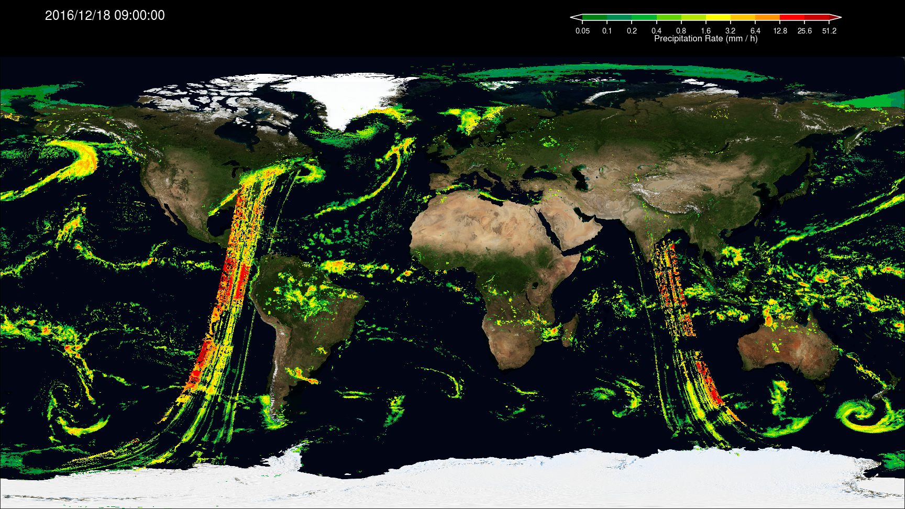
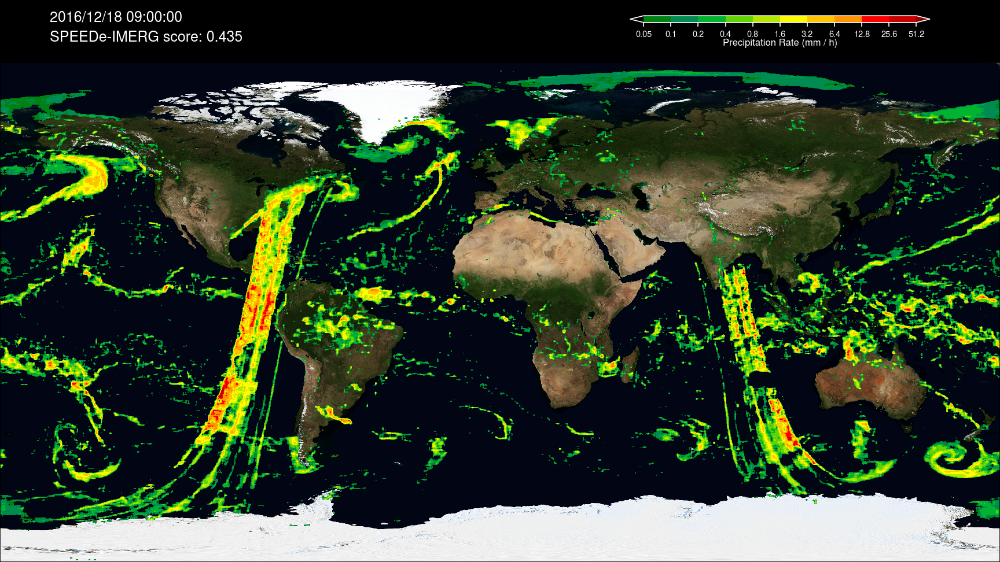
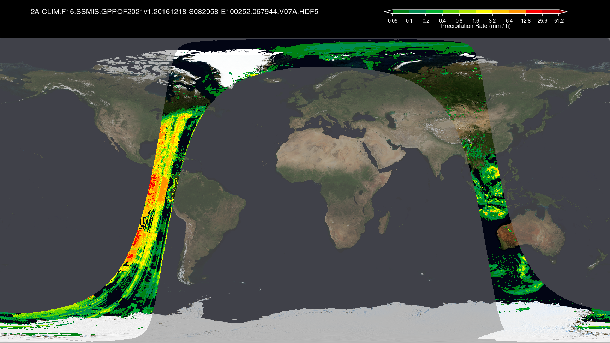
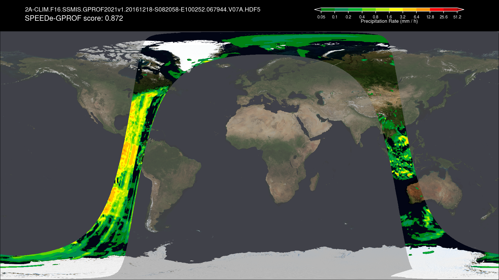

This repository contains the codes for the SPEEDe software and the analysis/plotting routines for the figures in 10.1029/2024GL108963.

# SPEEDe

## Introduction

The Satellite Precipitation Estimate Error Detector (SPEEDe) is a scheme that detects bad data in a two-dimensional satellite precipitation array. For each array, the scheme produces a score which increases in the presence of bad data, thus enabling the use of SPEEDe as an automated quality control scheme.

The precipitation arrays can be Level 3 precipitation products with dimensions of longitude and latitude, such as the Integrated Multi-satellitE Retrievals for GPM (IMERG) from the Global Precipitation Measurement (GPM) mission, or Level 2 precipitation products with dimensions of along-track and cross-track, such as the Goddard Profiling (GPROF) algorithm. As these satellite products obtain data from a diverse set of sources, the data quality can vary substantially, especially in passive microwave sensors. Low data quality can result from a myriad of causes, from instrument malfunction to geolocation error to calibration issues, manifesting as anomalous patterns such as streaks, speckles, excessive patches, or unrealistic gradients of precipitation in the precipitation fields.

SPEEDe is a machine learning–based image recognition algorithm with a convolutional autoencoder architecture that is designed to automate the detection of bad data. A convolutional autoencoder takes a two-dimensional input, reduces its size using convolution and max-pooling layers, then reverses the process using deconvolution and upscaling layers, giving a two-dimensional output with the same size as the input. The output is then compared to the input—effectively assuming the input as "truth"—with a loss function that quantifies the difference between the two. For anomaly detection, the convolutional autoencoder is trained only with data confirmed to be free of bad data so that the model parameters encode information about "good" precipitation patterns. Therefore, when bad data are encountered, SPEEDe produces an output that differs from the input substantially, resulting in a large absolute difference.

SPEEDe should be used in combination with other quality control tools for maximum effectiveness.

# Examples

Example of bad data in a half-hour snapshot of IMERG.

Example of the SPEEDe output corresponding to the bad IMERG data.

Example of bad data in a GPROF orbit.

Example of the SPEEDe output corresponding to the bad GPROF data.

# References

Huffman, G. J., and Coauthors, 2020: Integrated Multi-satellite Retrievals for the Global Precipitation Measurement (GPM) Mission (IMERG). Satellite Precipitation Measurement, V. Levizzani, C. Kidd, D.B. Kirschbaum, C.D. Kummerow, K. Nakamura, and F.J. Turk, Eds., Vol. 67 of Advances in Global Change Research, Springer International Publishing, 343–353, http://doi.org/10.1007/978-3-030-24568-9_19.

Huffman, G. J., and Coauthors, 2023: Algorithm Theoretical Basis Document (ATBD). NASA Global Precipitation Measurement (GPM) Integrated Multi-satellitE Retrievals for GPM (IMERG) Version 07. NASA, https://gpm.nasa.gov/resources/documents/imerg-v07-atbd.

Huffman, G. J., E. F. Stocker, D. T. Bolvin, E. J. Nelkin, and J. Tan, 2023: GPM IMERG Final Precipitation L3 Half Hourly 0.1 degree x 0.1 degree V07. https://doi.org/10.5067/GPM/IMERG/3B-HH/07.

Kummerow, C. D., D. L. Randel, M. Kulie, N.-Y. Wang, R. Ferraro, S. Joseph Munchak, and V. Petkovic, 2015: The Evolution of the Goddard Profiling Algorithm to a Fully Parametric Scheme. J. Atmos. Ocean. Tech., 32, 2265–2280, https://doi.org/10.1175/JTECH-D-15-0039.1.

Tan, J., G. J. Huffman, Y. Song, 2024: Automated Quality Control Scheme for GPM Satellite Precipitation Products. Geophys. Res. Lett., accepted for publication.

# License

Copyright © 2024 United States Government as represented by the Administrator of the National Aeronautics and Space Administration.   All Rights Reserved.

Disclaimer:
No Warranty: THE SUBJECT SOFTWARE IS PROVIDED "AS IS" WITHOUT ANY WARRANTY OF ANY KIND, EITHER EXPRESSED, IMPLIED, OR STATUTORY, INCLUDING, BUT NOT LIMITED TO, ANY WARRANTY THAT THE SUBJECT SOFTWARE WILL CONFORM TO SPECIFICATIONS, ANY IMPLIED WARRANTIES OF MERCHANTABILITY, FITNESS FOR A PARTICULAR PURPOSE, OR FREEDOM FROM INFRINGEMENT, ANY WARRANTY THAT THE SUBJECT SOFTWARE WILL BE ERROR FREE, OR ANY WARRANTY THAT DOCUMENTATION, IF PROVIDED, WILL CONFORM TO THE SUBJECT SOFTWARE. THIS AGREEMENT DOES NOT, IN ANY MANNER, CONSTITUTE AN ENDORSEMENT BY GOVERNMENT AGENCY OR ANY PRIOR RECIPIENT OF ANY RESULTS, RESULTING DESIGNS, HARDWARE, SOFTWARE PRODUCTS OR ANY OTHER APPLICATIONS RESULTING FROM USE OF THE SUBJECT SOFTWARE.  FURTHER, GOVERNMENT AGENCY DISCLAIMS ALL WARRANTIES AND LIABILITIES REGARDING THIRD-PARTY SOFTWARE, IF PRESENT IN THE ORIGINAL SOFTWARE, AND DISTRIBUTES IT "AS IS."
Waiver and Indemnity:  RECIPIENT AGREES TO WAIVE ANY AND ALL CLAIMS AGAINST THE UNITED STATES GOVERNMENT, ITS CONTRACTORS AND SUBCONTRACTORS, AS WELL AS ANY PRIOR RECIPIENT.  IF RECIPIENT'S USE OF THE SUBJECT SOFTWARE RESULTS IN ANY LIABILITIES, DEMANDS, DAMAGES, EXPENSES OR LOSSES ARISING FROM SUCH USE, INCLUDING ANY DAMAGES FROM PRODUCTS BASED ON, OR RESULTING FROM, RECIPIENT'S USE OF THE SUBJECT SOFTWARE, RECIPIENT SHALL INDEMNIFY AND HOLD HARMLESS THE UNITED STATES GOVERNMENT, ITS CONTRACTORS AND SUBCONTRACTORS, AS WELL AS ANY PRIOR RECIPIENT, TO THE EXTENT PERMITTED BY LAW.  RECIPIENT'S SOLE REMEDY FOR ANY SUCH MATTER SHALL BE THE IMMEDIATE, UNILATERAL TERMINATION OF THIS AGREEMENT.